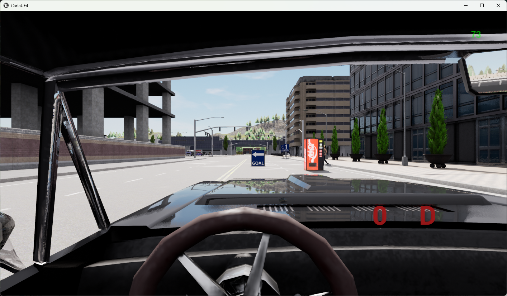

# Driving scenarios





## Student Model Code (with Think2Drive as Teacher Model)
  - [Uniad/VAD](https://github.com/Thinklab-SJTU/Bench2DriveZoo/tree/uniad/vad) in Bench2Drive
  - [TCP/ADMLP](https://github.com/Thinklab-SJTU/Bench2DriveZoo/tree/tcp/admlp) in Bench2Drive
## Setup
  - Download and setup CARLA 0.9.15
    ```bash
        mkdir carla
        cd carla
        wget https://carla-releases.s3.us-east-005.backblazeb2.com/Linux/CARLA_0.9.15.tar.gz
        tar -xvf CARLA_0.9.15.tar.gz
        cd Import && wget https://carla-releases.s3.us-east-005.backblazeb2.com/Linux/AdditionalMaps_0.9.15.tar.gz
        cd .. && bash ImportAssets.sh
        export CARLA_ROOT=YOUR_CARLA_PATH
        echo "$CARLA_ROOT/PythonAPI/carla/dist/carla-0.9.15-py3.7-linux-x86_64.egg" >> YOUR_CONDA_PATH/envs/YOUR_CONDA_ENV_NAME/lib/python3.7/site-packages/carla.pth # python 3.8 also works well, please set YOUR_CONDA_PATH and YOUR_CONDA_ENV_NAME
    ```

## Eval Tools
  - Add your agent to leaderboard/team_code/your_agent.py & Link your model folder under the Bench2Drive directory.
    ```bash
        Bench2Drive\ 
          assets\
          docs\
          leaderboard\
            team_code\
              --> Please add your agent HEAR
          scenario_runner\
          tools\
          --> Please link your model folder HEAR
    ```
  - Debug Mode
    ```bash
        # Verify the correctness of the team agent， need to set GPU_RANK, TEAM_AGENT, TEAM_CONFIG
        bash leaderboard/scripts/run_evaluation_debug.sh
    ```
  - Multi-Process Multi-GPU Parallel Eval. If your team_agent saves any image for debugging, it might take lots of disk space.
    ```bash
        # Please set TASK_NUM, GPU_RANK_LIST, TASK_LIST, TEAM_AGENT, TEAM_CONFIG, recommend GPU: Task(1:2).
        # It is normal that certain model can not finsih certain routes, no matter how many times we restart the evaluation. It should be treated as failing as it usually happens in the routes where agents behave badly.
        bash leaderboard/scripts/run_evaluation_multi_uniad.sh
    ```
  - Visualization - make a video for debugging with canbus info printed on the sequential images.
    ```bash
        python tools/generate_video.py -f your_rgb_folder/
    ```
  - Metric: **Make sure there are exactly 220 routes in your json. Failed/Crashed status is also acceptable. Otherwise, the metric is inaccurate.**
    ```bash
        # Merge eval json and get driving score and success rate
        # This script will assume the total number of routes with results is 220. If there is not enough, the missed ones will be treated as 0 score.
        python tools/merge_route_json.py -f your_json_folder/

        # Get multi-ability results
        python tools/ability_benchmark.py -r merge.json

        # Get driving efficiency and driving smoothness results
        python tools/efficiency_smoothness_benchmark.py -f merge.json -m your_metric_folder/
    ```
## Deal with CARLA

- CARLA has complex dependencies and is not stable. Please check the issue section of CARLA **very carefully**.
- Use tools/clean_carla.sh frequently and multiple times. Some CARLA processes are difficult to kill. Be sure to clean_carla could avoid lots of bugs.
- In our evaluation tools, the launch of CARLA is automatic: https://github.com/Thinklab-SJTU/Bench2Drive/tree/main/leaderboard/leaderboard/leaderboard_evaluator.py#L203. But you could always start CARLA by the one single command line to debug.
- CARLA is not controlled CUDA_VISIBLE_DEVICES! It is controlled by -graphicsadapter in the command line. **Interestingly, in some machines, for some unknown reasons, -graphicsadapter=1 is not available.** For example, with 4 GPUS, it might be: GPU0 -graphicsadapter=0, GPU1  -graphicsadapter=2, GPU2 -graphicsadapter=3, GPU3  -graphicsadapter=4.
- The conflict of PORT is frequently happened. Use lsof-i:YOUR_PORT frequently to avoid conflict. Avoid use small port numbers (<10000 could be unsafe).
- *4.26.2-0+++UE4+Release-4.26 522 0 Disabling core dumps*. Only showing these two lines without termination is good. *WARNING: lavapipe is not a conformant vulkan implementation, testing use only.* is bad.
- **If you face issues, always try to start CARLA in one single line to make sure CARLA could run.** If CARLA is finished immediately, it is very possible to be related to Vulkan. *Try /usr/bin/vulkaninfo | head -n 5*
- Re-install vulkan might be helpful *sudo apt install vulkan-tools; sudo apt install vulkan-utils*  In the end, you need to make sure your vulkan is correct. We have tested *Vulkan Instance Version: 1.x WARNING: lavapipe is not a conformant vulkan implementation, testing use only.* and version 1.1/1.2/1.3 works fine.
- We find that nvidia driver version 470 is good all the time. 515 has some problems but okay. 550 has lots of bugs.
- *sleep* is important to avoid crash of CARLA. For example, https://github.com/Thinklab-SJTU/Bench2Drive/blob/main/leaderboard/leaderboard/leaderboard_evaluator.py#L207, the sleep time should be extended for slower machines. When it comes to multi-gpu evaluation, https://github.com/Thinklab-SJTU/Bench2Drive/blob/main/leaderboard/scripts/run_evaluation_multi_uniad.sh#L58, the sleep time should also be extended for slower machines.


